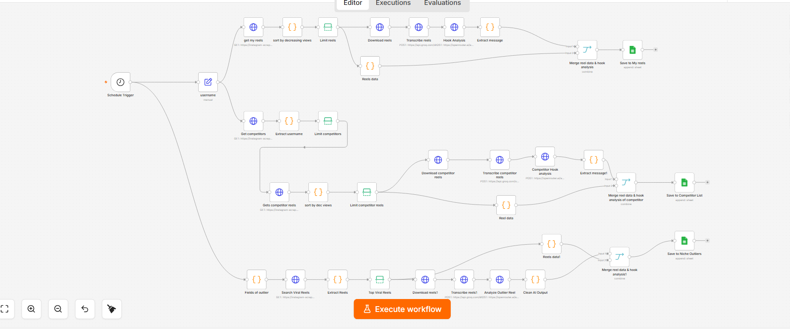
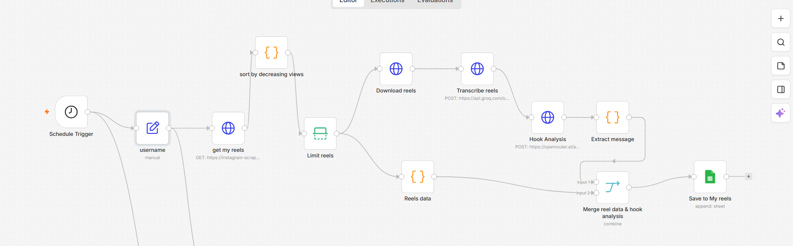
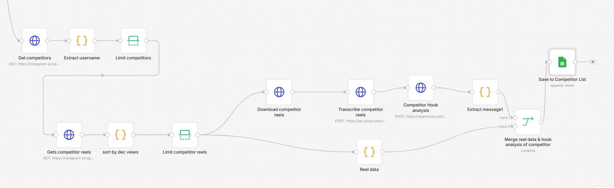
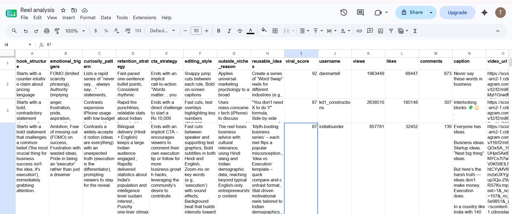
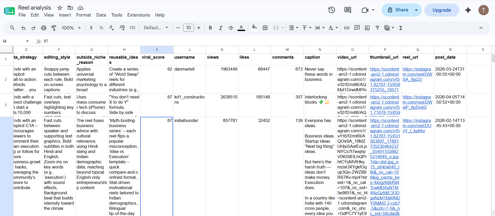
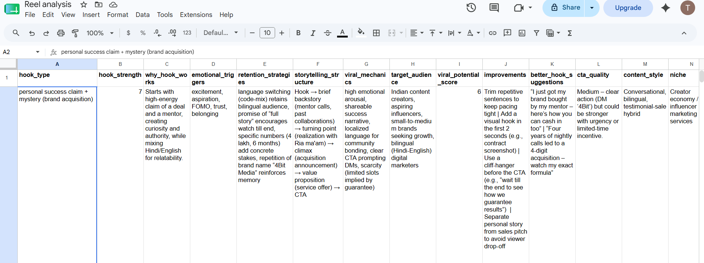
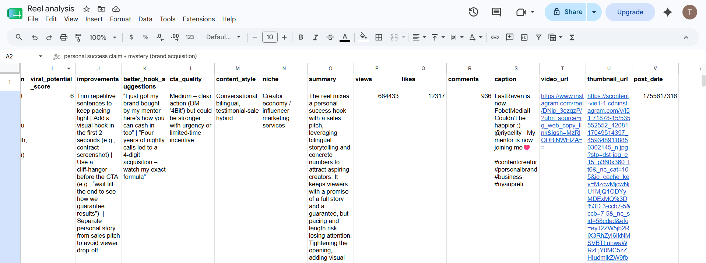
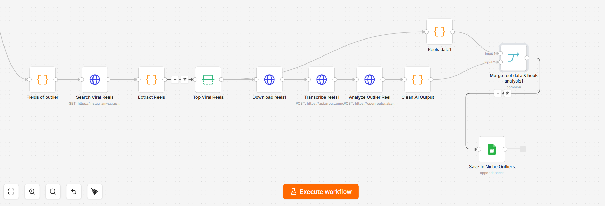

# 📱 Instagram Reels AI Analysis Workflow

An automated **n8n** workflow that scrapes, transcribes, and AI-analyzes Instagram Reels — your own, your competitors', and viral niche outliers — then saves structured insights to Google Sheets on a weekly schedule.

---

## 🗺️ Workflow Overview



The automation runs **3 parallel pipelines** triggered weekly:

| Pipeline | What it does | Output Sheet |
|----------|-------------|--------------|
| 🎬 My Reels | Fetches & analyzes your own top-performing reels | `My Reels` |
| 👥 Competitor Reels | Scrapes competitor accounts and analyzes their hooks | `Competitor List` |
| 🔥 Niche Outliers | Finds viral reels in your niche and reverse-engineers them | `Niche Outliers` |

---

## 🔄 Pipeline Breakdown

### 1 — My Reels Analysis



Fetches your Instagram reels, sorts by view count, downloads the top reels, transcribes audio with **Whisper**, and runs an **AI hook analysis** via OpenRouter. Results (hook type, emotional triggers, viral score, improvements) are merged with reel metadata and saved to Google Sheets.

**Nodes:** `get my reels → sort by decreasing views → Limit reels → Download reels → Transcribe reels → Hook Analysis → Extract message → Merge reel data & hook analysis → Save to My reels`

---

### 2 — Competitor Reels Analysis



Fetches your competitor list, extracts usernames, pulls each competitor's top reels by view count, downloads and transcribes them, then performs the same AI hook analysis. Saved to a separate competitor sheet.

**Nodes:** `Get competitors → Extract username → Limit competitors → Gets competitor reels → sort by dec views → Limit competitor reels → Download competitor reels → Transcribe competitor reels → Competitor Hook analysis → Extract message1 → Merge reel data & hook analysis of competitor → Save to Competitor List`

---

### 3 — Niche Outlier Discovery




Searches for viral reels in your niche using defined fields, extracts and limits the top performers, downloads and transcribes them, then runs a specialized **outlier analysis** prompt to identify what made them blow up. Results are saved to the Niche Outliers sheet.

**Nodes:** `Fields of outlier → Search Viral Reels → Extract Reels → Top Viral Reels → Download reels1 → Transcribe reels1 → Analyze Outlier Reel → Clean AI Output → Reels data1 → Merge reel data & hook analysis1 → Save to Niche Outliers`

---

## 📊 Sample Outputs

### My Reel Analysis



### Top Niche Outlier Analysis


---

## 🛠️ Tech Stack

| Tool | Purpose |
|------|---------|
| [n8n](https://n8n.io) | Workflow automation engine |
| [RapidAPI — Instagram Scraper](https://rapidapi.com) | Fetch reels & competitor data |
| [Groq Whisper large-v3](https://groq.com) | Fast audio transcription |
| [OpenRouter](https://openrouter.ai) | AI hook & viral analysis (GPT-class models) |
| [Google Sheets](https://sheets.google.com) | Structured output storage |

---

## ⚙️ Setup

### Prerequisites

- n8n instance (self-hosted or cloud)
- RapidAPI key with Instagram Scraper access
- Groq API key
- OpenRouter API key
- Google Sheets OAuth credentials configured in n8n

### Installation

1. Clone this repo:
   ```bash
   git clone https://github.com/Shubham-kumar2311/AI-Content-Automation-System.git
   cd AI-Content-Automation-System
   ```

2. Copy the environment example and fill in your keys:
   ```bash
   cp .env.example .env
   ```

3. Import `workflows/workflow.json` into your n8n instance via **Settings → Import workflow**.

4. In n8n, update the following credentials:
   - **RapidAPI key** in `get my reels`, `Get competitors`, `Gets competitor reels`, `Search Viral Reels` nodes
   - **Groq Bearer token** in `Transcribe reels`, `Transcribe competitor reels`, `Transcribe reels1` nodes
   - **OpenRouter Bearer token** in `Hook Analysis`, `Competitor Hook analysis`, `Analyze Outlier Reel` nodes
   - **Google Sheets OAuth** in all three `Save to ...` nodes

5. In the `username` node, update the value to your Instagram handle.

6. In the `Fields of outlier` node, set your niche keywords.

7. Activate the workflow — it runs **weekly at 17:00**.

---

## 📁 Project Structure

```
├── screenshots/
│   ├── workflow.png
│   ├── analysis_of_my_top_reels_flow.png.png
│   ├── analysis_of_my_top_competitor_reels_flow.png
│   ├── analysis_of_top_niche_outlier.png
│   ├── my_reel_analysis_1.png
│   ├── my_reel_analysis_2.png
│   ├── outlier_reel_analysis_1.png
│   └── outlier_reel_analysis_2.png
├── workflows/
│   └── workflow.json
├── .env.example
└── README.md
```

---

## 🤖 AI Analysis Fields

Each analyzed reel is scored across:

- `hook_type` — category of hook used
- `hook_strength` — score 1–10
- `why_hook_works` — explanation
- `emotional_triggers` — list of psychological triggers
- `retention_strategies` — techniques used to retain viewers
- `storytelling_structure` — narrative format
- `viral_mechanics` — what drives sharing
- `target_audience` — who this reel appeals to
- `viral_potential_score` — score 1–10
- `improvements` — suggested changes
- `better_hook_suggestions` — alternative hooks to test
- `cta_quality` — call-to-action effectiveness
- `content_style` — visual/narrative style
- `niche` — content niche
- `summary` — brief overall analysis

---
